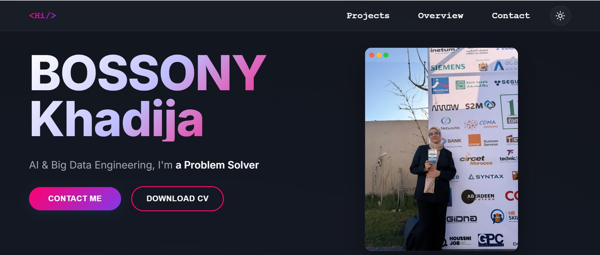

# Portfolio Website - BOSSONY Khadija

A modern, responsive portfolio website built with React and Vite, showcasing my work as an AI & Big Data Engineering student.

 

## 🚀 Live Demo

[View Live Site](https://bossony-khadija-portfolio.vercel.app/)

## ✨ Features

### 🎨 Design & UI
- **Dual Theme Support** - Seamless dark/light mode toggle with persistent storage
- **Responsive Design** - Fully optimized for mobile, tablet, and desktop views
- **Smooth Animations** - Framer Motion powered transitions and micro-interactions
- **3D Project Carousel** - Interactive carousel with 3D transform effects
- **Custom Scrollbar** - Themed scrollbar matching the overall design aesthetic
- **Gradient Effects** - Dynamic gradients and background particles in light mode

### 📱 Key Sections

#### Home Page
- **Hero Section** - Animated typewriter effect showcasing different roles
- **Live Demo Carousel** - Auto-rotating showcase of featured projects
- **Experience Timeline** - LinkedIn-style experience cards with hover effects
- **Education Section** - Interactive timeline with institution logos
- **Skills Grid** - Categorized skills with hover animations
- **Certifications** - Modal-enabled certificate showcase with download option

#### Projects Page
- **Coming Soon** - Placeholder for project showcase (ready for implementation)
- **Filter System** - Category-based project filtering (Development, Data Science, Games)

#### Contact Page
- **Split Card Design** - Social links and contact form in an elegant split layout
- **Formspree Integration** - Functional contact form with validation
- **Success/Error States** - Animated form submission feedback
- **Social Icons** - Color-coded social media links with hover effects

### 🛠 Technical Features
- **React Router** - Client-side routing with smooth navigation
- **Context API** - Theme management with localStorage persistence
- **Custom Hooks** - Reusable logic for scroll handling and animations
- **Modal System** - Reusable modals for certificates and project details
- **Particle System** - Canvas-based animated background for light mode
- **Lazy Loading** - Optimized image loading for better performance

## 🚀 Tech Stack

### Frontend
- **React 18** - UI library with hooks and functional components
- **Vite** - Next-generation build tool and dev server
- **Framer Motion** - Production-ready animations
- **React Router DOM** - Declarative routing
- **React Simple Typewriter** - Typewriter effect for hero section
- **Lucide React** - Beautiful, consistent icons
- **CSS3** - Custom CSS with CSS variables for theming

### Development Tools
- **ESLint** - Code linting
- **Prettier** - Code formatting
- **Git** - Version control
- **npm** - Package management

### APIs & Services
- **Formspree** - Form handling and email delivery
